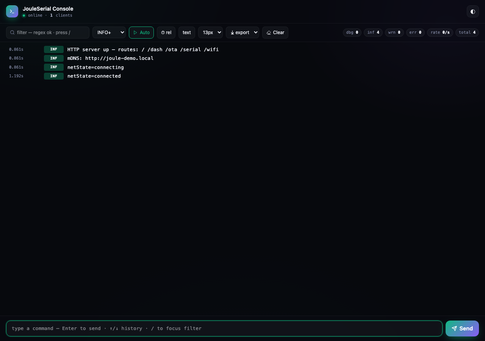
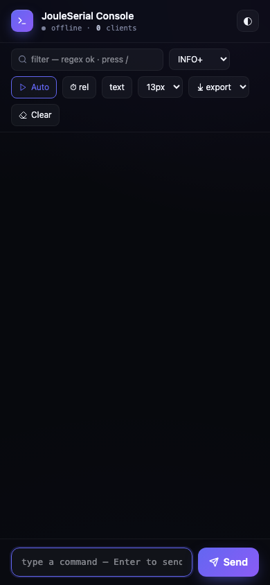

# JouleSerial

> Wireless serial console for ESP32 over a single bi-directional
> WebSocket. Four log levels with ANSI-coloured badges, history replay on
> reconnect, regex search, hex view, exports, multi-client, command input
> with arrow-key history. MIT-licensed, mobile-ready, **24 KB on the wire**.



**Author:** [Chinmoy Bhuyan](mailto:dikibhuyan@gmail.com) · **License:** MIT
· **Targets:** ESP32 (S2 / S3 / C3 / classic)

---

## Features

| | |
|---|---|
| ⚡  **WebSocket transport** | No HTTP polling; log latency is one `loop()` iteration |
| 🎨 **4 log levels with colour** | DEBUG / INFO / WARN / ERROR each get a distinct tinted badge |
| 🔄 **History replay** | New tab gets the last N lines (default 256) the instant it connects |
| 🔎 **Regex search** | Live filter — non-matching lines are hidden |
| 🪪 **Per-line timestamps** | Toggle relative seconds / uptime `hh:mm:ss` / off |
| 🧩 **Hex / ASCII view** | One-click toggle for binary debugging |
| ⤓  **Exports** | TXT / JSON / CSV; exports honour current filters |
| ⌨  **Command history** | Up/down arrows recall last 50 commands |
| 👥 **Multi-client sync** | Every tab sees the same stream and shares the command bar |
| 🔤 **Font controls** | 12–16 px live preview; persists in `localStorage` |
| 📊 **Live counters** | Per-level totals + lines/sec rate + connected-client count |
| 🪶 **Light on flash** | Pre-gzipped UI: 24 KB of flash, 66 KB after the browser inflates it |
| 📱 **Mobile-first** | Sticky command bar, 44 px touch targets |

---

## Quick start

```cpp
#include <WiFi.h>
#include <ESPAsyncWebServer.h>
#include <JouleSerial.h>

AsyncWebServer server(80);
volatile bool rebootRequested = false;

void setup() {
  WiFi.begin("YOUR_SSID", "YOUR_PASS");
  while (WiFi.status() != WL_CONNECTED) delay(200);

  JouleSerial.begin(&server, "admin", "joule");
  JouleSerial.onMessage([](const String &cmd){
    JouleSerial.inf("got command: %s", cmd.c_str());
    if (cmd == "reboot") rebootRequested = true;   // see "Inbound commands"
  });
  server.begin();

  JouleSerial.inf("hello from %s", WiFi.macAddress().c_str());
}

void loop() {
  JouleSerial.loop();
  if (rebootRequested) ESP.restart();

  static uint32_t last = 0;
  if (millis() - last > 2000) {
    last = millis();
    JouleSerial.dbg("heap=%u rssi=%d", ESP.getFreeHeap(), WiFi.RSSI());
  }
}
```

Open `http://<device-ip>/serial` and start typing.

---

## API reference

### Lifecycle

```cpp
void begin(AsyncWebServer *server,
           const String &username = "",
           const String &password = "");
void loop();          // call every iteration — reaps closed WebSocket clients
```

`begin()` mounts `/serial` and `/serial/ws`. If `username` is non-empty **both**
are gated with the same credentials — the WebSocket carries the full log and
accepts commands, so gating only the HTML would leave the device wide open.

`loop()` must be called from your `loop()`, and it is not optional. It does two
things:

* releases the client objects and message queues of disconnected tabs — skip it
  and the heap bleeds on every reconnect;
* **emits queued lines.** A `log()`/`dbg()` call only appends to the ring
  buffer; the hardware-Serial mirror and the WebSocket broadcast both happen
  here. Both of those block, and logging is explicitly allowed from the
  AsyncTCP callback, so doing them at call time would stall every other socket
  on the device (see [Threading](#threading)). The practical consequences: log
  latency is one `loop()` iteration, lines logged in `setup()` do not appear
  until the first `loop()`, and a sketch that blocks in `loop()` stops logging
  until it returns.

Calling `begin()` a second time only updates the credentials — the routes stay
as they were registered the first time.

`begin()` also reads and increments one 4-byte NVS counter (namespace
`joule-serial`, key `boot`). That is the device's boot id, and it is the high
half of every line's `seq` — see [WebSocket protocol](#websocket-protocol) for
why `seq` has to keep climbing across a restart. It is one flash write per
boot, in `setup()`, on the loop task. If NVS is unavailable the boot id stays
`0` and everything else still works.

### Print-style API (drop-in replacement for `Serial`)

`JouleSerialClass` inherits from `Print`, so anything that takes a `Print&`
or uses `print()`/`println()` works out of the box. Lines are flushed on
`'\n'` or `'\r'` (CRLF flushes once) and tagged as `INFO`. A line that reaches
512 characters without a terminator is flushed anyway, so a stream that never
sends one can't grow the accumulator without bound.

```cpp
JouleSerial.println("ready");
JouleSerial.print("temp=");
JouleSerial.println(t, 2);
```

### Levelled API

```cpp
void debug(const String &line);    // DBG badge
void info (const String &line);    // INF badge
void warn (const String &line);    // WRN badge
void error(const String &line);    // ERR badge
```

### `printf`-style helpers

```cpp
void dbg(const char *fmt, ...) __attribute__((format(printf,2,3)));
void inf(const char *fmt, ...) __attribute__((format(printf,2,3)));
void wrn(const char *fmt, ...) __attribute__((format(printf,2,3)));
void err(const char *fmt, ...) __attribute__((format(printf,2,3)));
```

Up to 159 bytes of formatted output is stack-buffered; longer lines are
re-formatted into a heap buffer, up to 2048 bytes. Beyond that — or if the
allocation fails — the line is clipped and marked with a trailing `…`, so a
truncated line never reads as a complete one.

### Inbound commands

```cpp
using SerialMessageCb = std::function<void(const String &command)>;
void onMessage(SerialMessageCb cb);
```

The callback fires once per command-bar Enter press. The `command` string
is exactly what the user typed (no trim, no level prefix).

> **The callback runs on the AsyncTCP task, not from `loop()`.** Do not call
> `delay()`, `ESP.restart()`, or blocking flash/NVS writes inside it: they
> stall every other socket on the device, and restarting from there tears down
> the TCP stack from inside its own callback. Set a flag and act on it in
> `loop()` — see the quick start above. Logging from the callback is fine: a
> log call only appends to the ring buffer, and the parts that block are done
> by `loop()`.

Commands must arrive in a single WebSocket frame. Anything long enough to
fragment (roughly a multi-kilobyte paste) is rejected with an `ERROR` line in
the console rather than dropped silently.

### Configuration

```cpp
void setHistorySize(size_t n);                   // default 256
void setTitle(const String &t);
void setBrandColor(const String &cssColor);
void setMirrorToHardwareSerial(bool on);         // default true
```

`setMirrorToHardwareSerial(false)` skips the `Serial.print` mirror — useful
for headless devices that have no UART pinout.

---

## HTTP endpoints

| Path | Method | Description |
|---|---|---|
| `/serial`    | GET | The console SPA |
| `/serial/ws` | WS  | Bi-directional log + command stream |

Both honour the credentials passed to `begin()`. `/serial/ws` accepts an
optional `?since=<seq>` query parameter: the replayed history then contains
only lines newer than `seq`, which lets a reconnecting client skip lines it
already has. Pass back the largest `seq` you have seen, verbatim — it is a
64-bit value, so parse and re-emit it as a whole number, not an `int32`. The
bundled UI does not use it; it drops any line whose `seq` it has already seen.

### WebSocket protocol

**Server → client** (one JSON object per frame):

```jsonc
// On connect — one or more frames, 64 lines each, in seq order:
{"type":"hist","boot":7,"title":"Production console","brand":"#2ee5a0",
 "lines":[{"seq":30064771073,"ms":836,"lvl":1,"text":"HTTP server started"}, …]}

// Live log line:
{"type":"line","seq":30064771074,"ms":12345,"lvl":2,"text":"low voltage"}

// Client-count change:
{"type":"clients","n":3}
```

`lvl` is `0` (DEBUG) · `1` (INFO) · `2` (WARN) · `3` (ERROR). `ms` is uptime in
milliseconds when the line was logged — accumulated across the 49.7-day
`millis()` rollover, so it stays monotonic on long-running devices and can
exceed 2³².

#### `seq` and the boot id

`seq` is `(boot << 32) + line-number-within-this-boot`, so it is **monotonic
across reboots**, not just within one run. `boot` is an NVS counter incremented
once per `begin()` and also sent as its own field on every `hist` frame.

This matters because every sensible client — the bundled UI included — dedupes
on a monotonic `seq` and keeps that high-water mark across its auto-reconnect.
When the counter restarted at `1` on every boot, a tab that had reached
`seq 500` before a restart discarded the entire replayed history *and* every
live line after it, for as long as it took the device to re-log 500 lines. The
pill went green and the console was dead. Folding the boot id into `seq` fixes
that without the client needing to know anything: the numbers simply keep going
up. The separate `boot` field is there so a client that keeps per-session state
(a scroll anchor, an export buffer) can notice the restart explicitly and reset
its high-water mark rather than relying on the range jump.

Two consequences for anything parsing this:

* `seq` exceeds 2³² and is emitted as a plain JSON number. It stays inside
  IEEE-754 exact-integer range (2⁵³) for the first ~2 million boots, so
  JavaScript's `JSON.parse` reads it exactly — but a client on a 32-bit integer
  type must widen to 64 bits.
* `seq` is not a line count. Line `n` of boot `b` is `b × 2³² + n`; the
  difference between two `seq` values is only a gap count within one boot.

Clients written against the old wire format keep working unchanged: `seq` is
still a number that only ever increases, `hist` and `line` are unchanged in
shape, and `boot` is an added field that an older parser ignores.

**Client → server**:

```json
{"type":"cmd","text":"reboot"}
```

`type` must be a string equal to `cmd`; frames of any other type — including
ones where `type` is a number or is missing entirely — are ignored and never
reach your handler. Key order does not matter: `{"text":"reboot","type":"cmd"}`
is accepted too. Backslash escapes in `text` are decoded, so
`set name \"foo\"` arrives as `set name "foo"`.

---

## UI walkthrough

| Bar | Control | Function |
|---|---|---|
| Header | Title + WS status pill + theme toggle (◐) | Live |
| Top bar | `filter` text input | Regex filter on log body — press `/` from anywhere to focus |
| | Level selector | Min-level filter (DEBUG+ / INFO+ / WARN+ / ERROR) |
| | `▼ Auto` / `⏸ Hold` | Toggle autoscroll; auto-disables when you scroll up |
| | `⏱ rel` / `uptime` / `off` | Timestamp display, both modes rendered from the line's own `ms`. `rel` shows seconds since boot to 3 dp (`12.345s`); `uptime` shows the same value as `hh:mm:ss.s`. Neither is wall-clock — the device ships no clock, and the UI never consults `Date` — so correlating with anything external means noting the device uptime at a known instant |
| | `𝟬𝟭 text` / `hex` | Toggle hex view |
| | Font selector | 12 / 13 / 14 / 16 px |
| | Export menu | TXT · JSON · CSV (current filter applied) |
| | `✕ Clear` | Wipe local view (server history preserved) |
| | Chips | dbg / inf / wrn / err totals + lines/sec + total + client count |
| Log pane | One row per line: timestamp · level badge · text | Hover to highlight |
| Bottom bar | Command input + `Send ↵` | Up/Down arrows step through last 50 commands |

Mobile (390 px wide):



---

## Patterns

### Routing commands to handlers

```cpp
volatile bool rebootRequested = false;

JouleSerial.onMessage([](const String &cmd){
  // Async context: dispatch fast, defer anything blocking or fatal.
  if      (cmd == "reboot")      rebootRequested = true;
  else if (cmd == "heap")        JouleSerial.inf("heap = %u", ESP.getFreeHeap());
  else if (cmd.startsWith("set ")) handleSetCmd(cmd.substring(4));
  else                           JouleSerial.wrn("unknown: %s", cmd.c_str());
});
```

### Replacing `Serial.printf` calls everywhere

```cpp
// before
Serial.printf("got %d packets\n", n);
// after
JouleSerial.inf("got %d packets", n);   // also still goes to Serial
```

### Streaming a CSV log from your code

Just call `JouleSerial.inf()` with comma-separated fields; the UI's CSV
export will re-quote them correctly:

```cpp
JouleSerial.inf("%lu,%d,%.2f", millis(), pktCount, currentA);
```

User clicks **Export → CSV** to download.

### Embedding in your own app

```cpp
AsyncWebServer server(80);
JouleSerial.begin(&server);            // mounts /serial + /serial/ws
server.on("/api/state", HTTP_GET, …);  // your own routes still work
server.begin();
// …and JouleSerial.loop(); from loop()
```

### Silent mode (no hardware UART output)

```cpp
JouleSerial.setMirrorToHardwareSerial(false);
```

---

## Threading

Two FreeRTOS tasks touch this library, and which one runs what is the only
thing here worth internalising.

| Work | Task |
|---|---|
| `log()` / `print()` / `dbg()` — append to the ring | whichever task calls it: `loop()` **or** AsyncTCP |
| `onMessage` callback, history replay on connect | AsyncTCP |
| Serial mirror, WebSocket broadcast of new lines | `loop()` only |

Because the `onMessage` contract explicitly allows logging, `log()` is
reachable from the AsyncTCP task on the mainline path. So `log()` does nothing
but take a mutex, stamp a sequence number and append to the ring. `loop()`
picks the new lines up and does both blocking parts:

* `Serial.printf` blocks. On a classic ESP32 UART a full 256-byte TX buffer
  stalls ~22 ms per line; with `ARDUINO_USB_CDC_ON_BOOT=1` a USB host that is
  enumerated but not reading (a device on a wall charger) blocks until the CDC
  TX timeout. Doing that on the AsyncTCP task stalls every socket on the chip.
* Emitting from one task keeps `seq` order on the wire. When the sequence
  number was taken under the lock but broadcast outside it, two tasks could
  swap a pair, and a client that dedupes on monotonic `seq` — the bundled UI
  does — would discard the loser permanently, including on every later replay.
  The same dedupe is why `seq` carries a boot id: see
  [`seq` and the boot id](#seq-and-the-boot-id).

The same mutex covers `_writeBuf`, the `print()` accumulator, so the Print API
is safe from either task too — a bare `+=` on a shared `String` reallocates,
and the losing task then writes through a freed pointer. It also covers the
`setTitle()` / `setBrandColor()` strings, which a connecting client reads on
the AsyncTCP task.

The mutex is never held across `Serial.printf`, `textAll()` or
`client->text()`. The socket takes its own client lock before invoking the
connect handler, which then takes ours, so locking in the other order would
deadlock.

## Performance notes

* Log frames are JSON-encoded inline (no ArduinoJson dependency at run-
  time). String-escape covers `" \ \n \r \t` and control bytes.
* Lines are throttled to a per-event push (no batching) — typical 10–
  100 lines/sec is fine. A burst that outruns a slow client overflows that
  client's send queue (32 messages on ESP32) and the excess is dropped **for
  that client only**, with no marker in its console. The `seq` field is
  monotonic, so a client that cares can detect the gap itself; the bundled UI
  does not. Keep bursts small if the log is the evidence.
* The history ring is FIFO; resize with `setHistorySize(n)`. Each line
  costs roughly `text.length() + 40` bytes.
* History replay is chunked into `hist` frames of 64 lines (~5 KB each) rather
  than one frame per ring. A 1024-line ring is ~75 KB of JSON, which as a
  single frame needs one contiguous block to build and a second copy inside
  `client->text()` — a likely allocation failure once the heap has fragmented.
  Chunking also bounds how long the ring mutex is held, so a connecting client
  no longer blocks logging for the length of a whole encode. Rings past roughly
  2000 lines exceed the 32-message client send queue and will replay partially.
* The hex-view conversion happens client-side; the server always sends
  the raw text.

---

## Troubleshooting

| Symptom | Cause | Fix |
|---|---|---|
| Console connects then disconnects in a loop | Auth set on the server but credentials wrong | Verify `username` / `password` match what `begin()` saw |
| Lines appear out of order | None — `seq` is monotonic | Sort client-side by `seq` if you care |
| Console is empty after a device reboot | The ring is in RAM — a restart clears it, so there is nothing to replay until the sketch logs again | Expected. The tab itself keeps working: `seq` carries a boot id, so new lines are not mistaken for ones already seen ([details](#seq-and-the-boot-id)) |
| Console goes permanently silent after a reboot — pill green, no new lines | A client that dedupes on `seq` is holding a high-water mark from before the reboot, and the device is re-using the same numbers | Fixed in this version by the boot id in `seq`, provided NVS is writable. If the boot id is stuck at `0` (NVS full or read-only) reload the page to reset the client |
| Long lines end in `…` | Format result exceeded 2048 bytes, or the heap buffer could not be allocated | Split the log into pieces |
| Free heap falls on every reconnect | `JouleSerial.loop()` is not being called | Call it from your `loop()` |
| Nothing appears in the console or on the UART, but the sketch is clearly logging | `JouleSerial.loop()` is not being called, or `loop()` is blocked in a long `delay()` / busy wait | Lines are emitted from `loop()` by design — call it, and don't block in it |
| Lines logged in `setup()` are missing from the UART | Same cause: they are emitted on the first `loop()` iteration | Expected; they still appear, just later |

---

## Dependencies

* `ESP32Async/ESPAsyncWebServer @ ^3.7.0` — `AsyncURIMatcher::exact()` comes
  from here, not from the Arduino core
* `ESP32Async/AsyncTCP @ ^3.4.0`

* `Preferences` — from the Arduino-ESP32 core, not a `library.json` entry.
  One 4-byte NVS counter for the boot id.

`ArduinoJson` is deliberately absent from `library.json`: the log and command
frames are encoded and parsed inline, so nothing here needs it.

`library.json` lists `espressif32` only, and now means it. `src/` has one
platform-specific piece — the `Preferences`/NVS boot counter behind
`nextBootId()` — plus the `AsyncTCP` dependency above, which is declared
unconditionally and is ESP32/LibreTiny-only, so an ESP8266 build would resolve
the wrong TCP backend. A port would need a replacement for both: any storage
that survives a power cycle works for the counter (ESP8266 has its own
`EEPROM`/RTC options), and upstream pulls `ESP32Async/ESPAsyncTCP` for
`espressif8266`. Neither is hard; both are untested here.

---

## License

MIT — see [LICENSE](LICENSE).

---

<sub>**Author:** Chinmoy Bhuyan · **Email:** dikibhuyan@gmail.com · **(c)** 2026 — MIT</sub>
